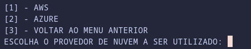
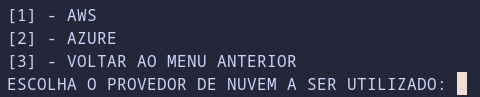

## Ambientes Virtuais de Aprendizagem para o Kubernetes
---

<p align="justify">
Esse repositório oferece uma ferramenta de linha de comando que proporciona um ambiente de estudos para o Kubernetes utilizando o Kubeadm de maneira simples e intuitiva, visando o menor custo possível. A ferramenta é direcionada a usuários universitários da rede pública, sendo compatível com os provedores de nuvem Azure e AWS, que oferecem acesso gratuito para estudantes.
</p>

---
#### Observações
---
+ Atualmente, a ferramenta pode criar clusters Kubernetes nas nuvens Azure e AWS.
+ A ferramenta foi testada apenas nos ambientes Linux Ubuntu, caso queira utilizá-la no windows siga esse passo a passo para configuração do [WSL]() no windows.

---
### 1. Baixando a ferramenta.
___
+ Instale o git no linux ubuntu com o seguinte comando
```bash
sudo apt install git
```
+ Para instalar a ferramenta, basta clonar este repositório com o comando:
```bash
git clone https://github.com/Luizaaf/VLE-kubernetes.git ~/Downloads/VLE-kubernets
```
---
### 2. Resolvendo dependências.
---

+ Python:
	+ O Python já vem pré-instalado em computadores Linux.
+ Unzip:
	+ Para instalar o utilitario unzip no linux Ubuntu execute o seguinte comando:
	```bash
	sudo apt update
	sudo apt install unzip -y
	```
+ Terraform.
	+ Para instalar o terraform no linux Ubuntu execute, os seguintes comandos:
	```bash

	curl -s https://releases.hashicorp.com/terraform/1.10.4/terraform_1.10.4_linux_amd64.zip -o /tmp/terraform.zip
	unzip -o /tmp/terraform.zip -d /tmp
	sudo mv /tmp/terraform /usr/local/bin/
	```
	+ Após isso, teste se o comando foi instalado corretamente executando:
	```bash
	terraform --version
	```
	+ Saida:
	
	```
	Terraform v1.10.4
	on linux_amd64

	Your version of Terraform is out of date! The latest version
	is 1.10.5. You can update by downloading from https://www.terraform.io/downloads.html
	```

+ Ansible.
	+ Instale o ansible por meio do seguinte comando:
	```bash
	sudo apt install ansible -y
	```

+ AWS CLI (caso você vá utilizar a AWS):
	+ Para instalar a AWS CLI no Linux, execute os seguintes comandos:
	```bash
	curl "https://awscli.amazonaws.com/awscli-exe-linux-x86_64.zip" -o "awscliv2.zip"
	unzip awscliv2.zip
	sudo ./aws/install
	```
+ Azure CLI (caso vá utilizar a Azure):
	+ Para instalar a Azure CLI no Linux, execute os seguintes comandos:
	```bash
	curl -sL https://aka.ms/InstallAzureCLIDeb | sudo bash
	```
+ jq
	+ Para instalar o comando jq no Linux, execute os seguintes comandos:
	```bash
	sudo apt install jq -y
	```
	
---
### 3. Criação de Contas nos Ambientes de Nuvem
---
+ **AWS:** Não é possível criar uma conta por conta própria. Solicite ao seu professor para incluí-lo em uma conta do AWS Academy.
+ **Azure:** Para criar uma conta na Azure, siga o passo a passo contido no link: [Configurando conta gratuita na Azure](configuracoes_md/criacao_conta_azure.md).
---
### 4. Configuração da Ferramenta para Utilização do Ambiente de Nuvem
---
Após a criação das contas conforme as instruções anteriores, é necessário garantir que a ferramenta tenha acesso a elas. Siga os passos de acordo com a nuvem escolhida:

+ **AWS Academy:** Se for utilizar a AWS, siga as instruções em: [Configurando ferramenta para acessar o AWS Academy](configuracoes_md/configuracao_aws.md).
+ **Azure:** Se optar pela Azure, siga as instruções em: [Configurando a ferramenta para acessar a Azure](configuracoes_md/configuracao_azure.md).
---
### 5. Utilizando a ferramenta.
---
+ Acesse o diretório e execute o arquivo main.py:

```bash
cd ~/Downloads/VLE-kubernets
python3 main.py
```
+ Você será apresentado à seguinte interface.

+ 

+ Nessa interface, você tem acesso a 4 opções:

1. CRIAR CLUSTER KUBERNETS.
	+ Nesta opção, você pode criar um cluster Kubernetes para estudos. Ao selecionar esta opção, você verá a seguinte tela:
	+ 
	+ Nessa tela, escolha a nuvem a ser utilizada e a criação do seu cluster será iniciada.
2. CENÁRIO GUIADO.
	+ Esta opção fornece um link para acessar um cenário guiado disponível neste repositório.
3. DESTRUIR CLUSTER KUBERNETS.
	+ Nesta opção, você pode destruir o cluster criado. Ao selecionar esta opção, verá a seguinte tela:
	+ 
	+ Escolha a nuvem a ser utilizada e seu cluster será destruído.
4. SAIR.
	+ Esta opção encerra a ferramenta.
---

## Cenário de estudo

1. [Realizado deploy simples de uma aplicação Python no Kubernetes](cenarios/deploy_app.md)