# AMBIENTES VIRTUAIS DE APRENDIZAGEM PARA O KUBERNETES
---

<p align="justify">
Este repositório disponibiliza uma ferramenta de linha de comando que simplifica a criação de ambientes de estudo para o Kubernetes com o Kubeadm, combinando praticidade e baixo custo. Desenvolvida especialmente para estudantes de universidades públicas, a solução integra-se aos serviços gratuitos oferecidos pela AWS e Azure para usuários acadêmicos, permitindo a configuração de clusters Kubernetes sem complicações.
</p>

---
### OBSERVAÇÕES
---

+ **Compatibilidade com nuvens:** Criação de clusters Kubernetes nas plataformas **Azure** e **AWS**.
+ **Requisitos do sistema:** Testada em ambientes *Linux Ubuntu*. Para uso no Windows, configure o [WSL]() seguindo o guia passo a passo.

---
## 1. BAIXANDO A FERRAMENTA
___

1. Instale o [Git](https://git-scm.com/downloads/linux) no Ubuntu usando o comando abaixo:

```bash
sudo apt install git
```

2. **Instalação da ferramenta:** Clone o repositório executando o comando abaixo:

```bash
git clone https://github.com/Luizaaf/VLE-kubernetes.git ~/Downloads/VLE-kubernetes
```
---
## 2. RESOLVENDO DEPENDÊNCIAS
---

<details> <summary> Pré-requisitos para utilização <b>(clique para exibir)</b> </summary>

+ **[Python](https://www.python.org/):**  

   + Já incluído por padrão em sistemas Linux. Verifique com `python3 --version`.

+ **Unzip:**  
   
   + Instale no Ubuntu com:  
   
   ```bash
   sudo apt update        
   sudo apt install unzip
   ```

+ Terraform:
	
	+ Instale a versão 1.10.4 com:
	
	```bash
	curl -s https://releases.hashicorp.com/terraform/1.10.4/terraform_1.10.4_linux_amd64.zip -o /tmp/terraform.zip
	unzip -o /tmp/terraform.zip -d /tmp
	sudo mv /tmp/terraform /usr/local/bin/
	```
	+ Verifique se a instalação ocorreu com sucesso:
	
	```bash
	terraform --version
	```
	
	+ Saída esperada (versão pode variar):
	
	```
	Terraform v1.10.4
	on linux_amd64
	```

+ Ansible.
	
	+ Instale o Ansible no Ubuntu com o seguinte comando:
	
	```bash
	sudo apt install ansible -y
	```

+ AWS CLI (apenas necessário caso vá utilizar a AWS):

	+ Para instalar a [AWS CLI](https://docs.aws.amazon.com/cli/latest/userguide/getting-started-install.html) no Linux, execute os seguintes comandos:
	
	```bash
	curl "https://awscli.amazonaws.com/awscli-exe-linux-x86_64.zip" -o "awscliv2.zip"
	unzip awscliv2.zip
	sudo ./aws/install
	```
+ Azure CLI (apenas necessário caso vá utilizar a AWS):
	
	+ Para instalar a [Azure CLI](https://learn.microsoft.com/pt-br/cli/azure/install-azure-cli-linux) no Linux, execute os seguintes comandos:
	
	```bash
	curl -sL https://aka.ms/InstallAzureCLIDeb | sudo bash
	```
+ jq
	
	+ Para instalar o utilitário [jq](https://jqlang.org/download/) no Linux, execute os seguintes comandos:

	```bash
	sudo apt install jq -y
	```
</details>

---
### 3. CRIAÇÃO DE CONTAS NOS AMBIENTES DE NUVEM
---

1. **AWS:** Para utilizar a AWS, *solicite ao seu professor* o cadastro no [AWS Academy](https://aws.amazon.com/education/awsacademy/). Não é possível criar uma conta por conta própria.
<details> <summary> 2. <b>Azure</b>: Criar conta gratuíta no Azure para estudantes <b>(clique para exibir)</b> </summary>

### CRIANDO CONTA GRATUITA NO AZURE PARA ESTUDANTES

1. Acesse o site https://azure.microsoft.com/pt-br/free/students

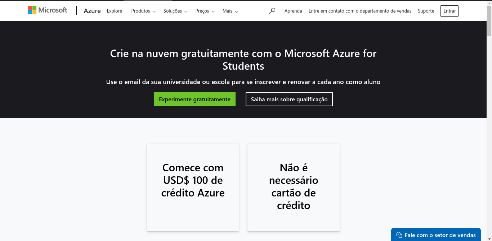

2. Acesse sua conta microssoft colocando usuário e senha. Caso não possua crie uma.

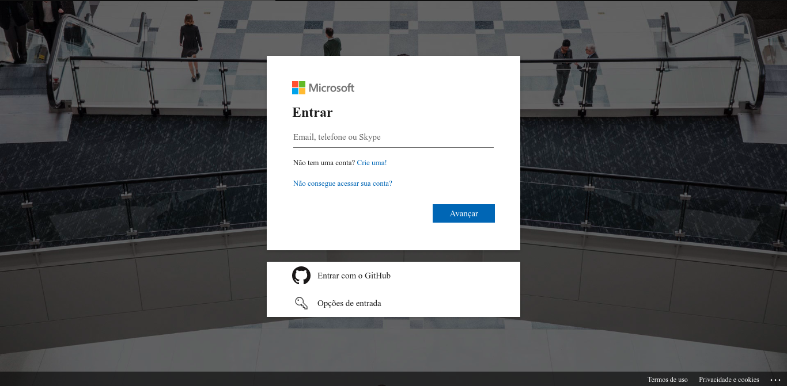

3. Preencha o questionário com seu nome, sobrenome, país de origem, universidade, data de nascimento e email institucional.

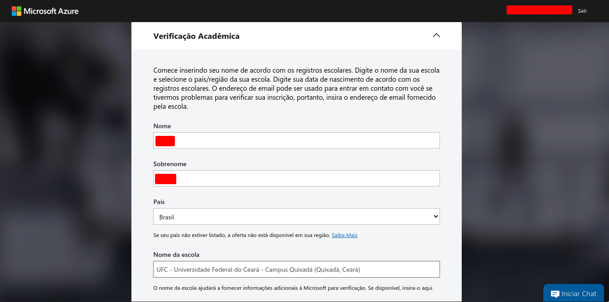
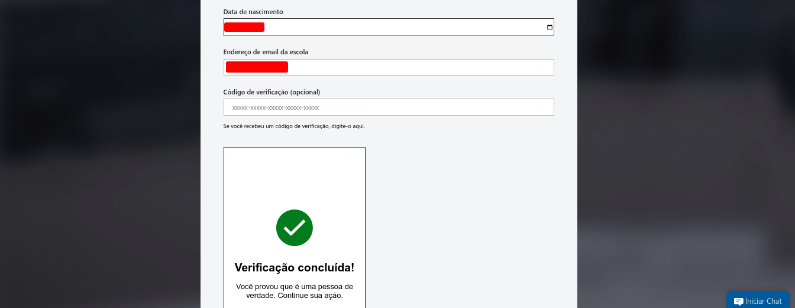

4. Realize a verificação do email institucional.

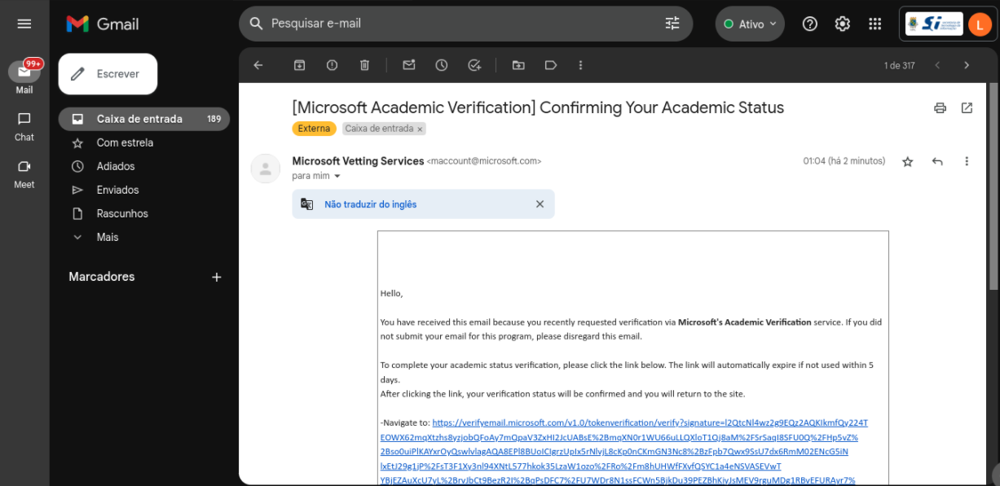

5. Após isso você será redirecionado para uma página que irá testar se você é realmente humano. Realize o teste e siga para a proxima página.

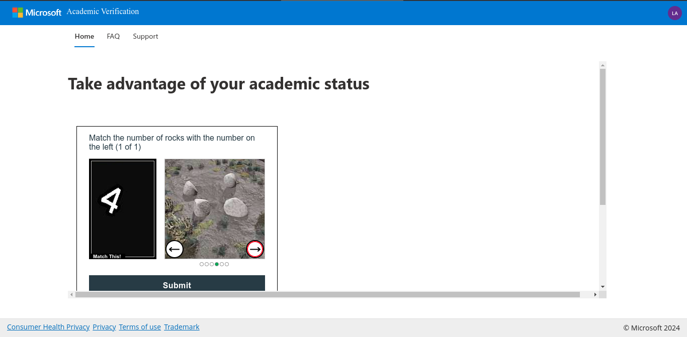

6. Aceite os termos e pronto, você terá 100 USD para gastar como quiser na Azure.

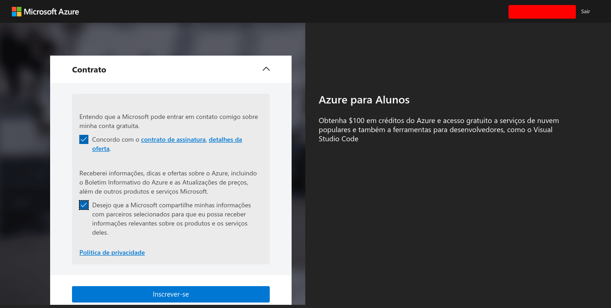

</details>

---
### 4. CONFIGURAÇÃO DA FERRAMENTA PARA UTILIZAÇÃO DO AMBIENTE DE NUVEM
---

<p align="justify">Após a criação das contas conforme as instruções anteriores, é necessário garantir que a ferramenta tenha acesso a elas. Siga os passos de acordo com a nuvem escolhida:<\p>

<details> <summary> 1. <b>AWS Academy:</b>: Caso tenha optado pela utilização da AWS. <b>(clique para exibir)</b> </summary>

## Configurando o AWS CLI

+ Acesse o AWS Academy.


1. Após ter acesso o AWS academy e iniciado seu laborátorio irá clicar em `AWS Details`, e baixe sua chave de acesso.

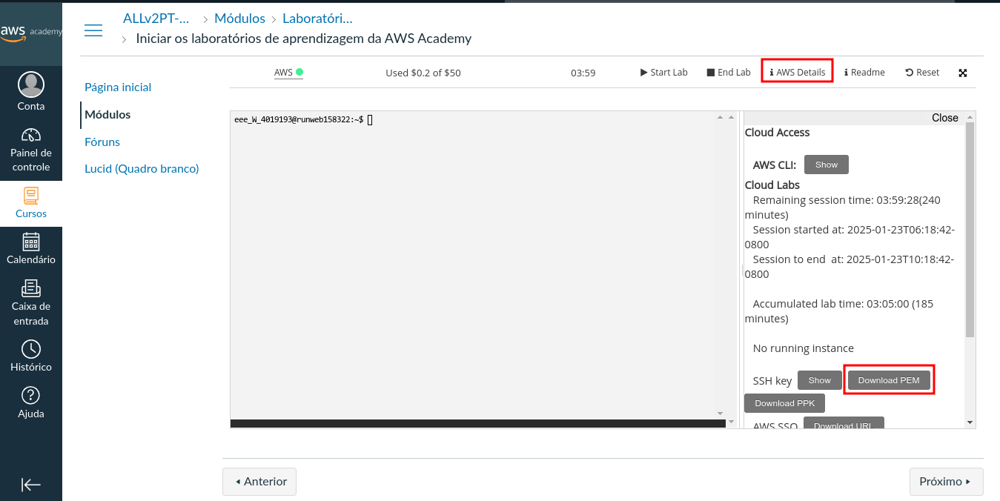

2. Após isso clique em `AWS CLI: Show`, copie o conteúdo que irá aparecer.

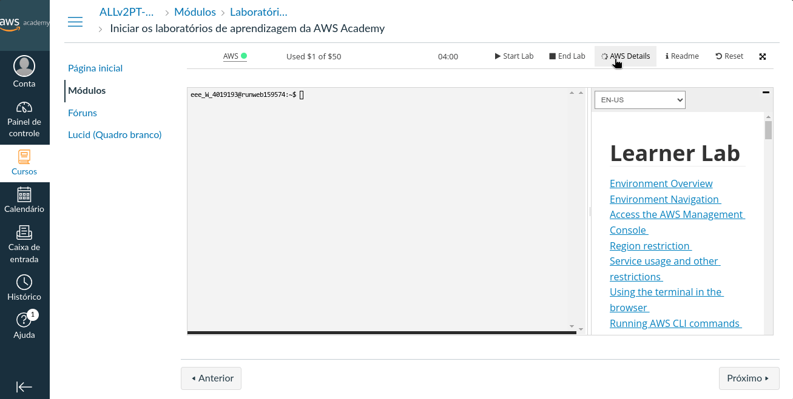

3. Após isso execute o seguinte comandos em seu terminal.

```bash
aws configure
```

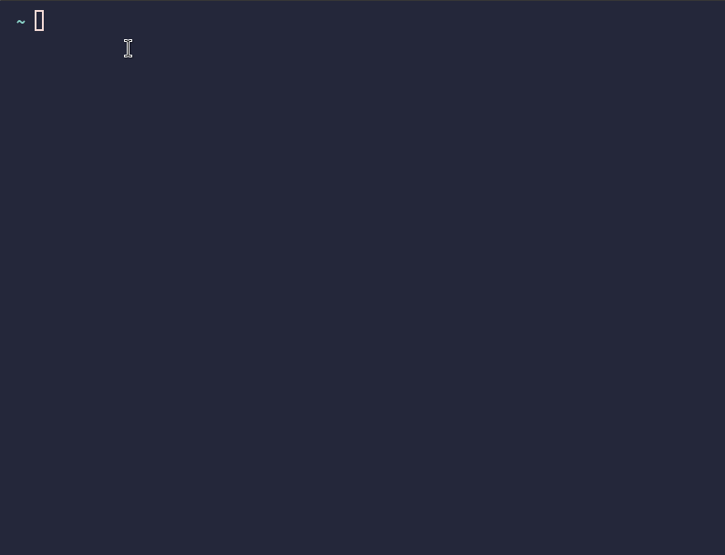

4. Após isso você irá colar o conteúdo copiado no passo 2 no arquivo `~/.aws/credentials`

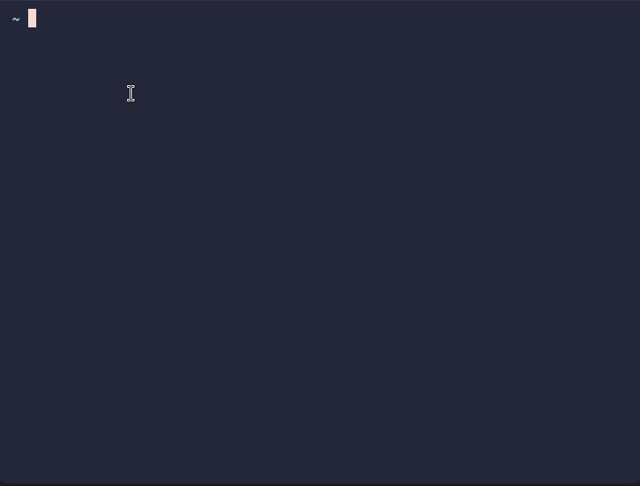

5. A ferramenta espera que a chave de acesso esteja em `~/.aws/`, para funcionar corretamente, então por favor copie a chave de acesso baixada no passo 1 para `~/.aws`, com o seguinte comando.

```bash
mv LOCAL_ONDE_A_CHAVE_FOI_BAIXADA ~/.aws

```

+ Dê as permissões necessárias com o seguinte comando.

```bash
chmod 0600 ~/.aws/labsuser.pem
```

> [!IMPORTANT]
> Toda vez que você iniciar uma sessão no AWS Academy, suas credenciais irão ser alteradas, desse modo você precisa copiar seus dados e colar novamente em ~/.aws/credentials, para a ferramenta funcionar corretamente.

</details>

<details> <summary> 2. <b>Azure:</b>: Caso tenha optado pela utilização da Azure. <b>(clique para exibir)</b> </summary>

### Configurando a Azure para uso da ferramenta.

+ **Execute o seguinte comando para logar em seu navegador padrão.**

```
az login
```

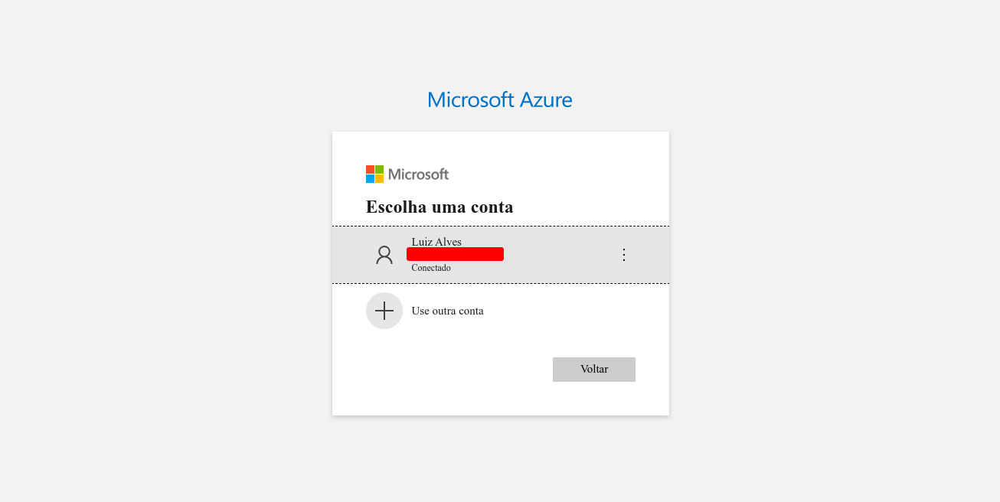

+ **Será apresentado essa saída em seu terminal**


> [!IMPORTANT]
> Caso voçê possua mais de uma conta na azure, é necessário que você defina a conta a ser utilizada.

</details>

---
### 5. UTILIZANDO A FERRAMENTA
---
+ Acesse o diretório e execute o arquivo main.py:

```bash
cd ~/Downloads/VLE-kubernets
python3 main.py
```
+ Você será apresentado à seguinte interface.

+ 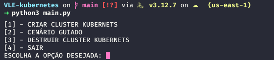

+ Nessa interface, você tem acesso a 4 opções:

1. CRIAR CLUSTER KUBERNETS.
	+ Nesta opção, você pode criar um cluster Kubernetes para estudos. Ao selecionar esta opção, você verá a seguinte tela:
	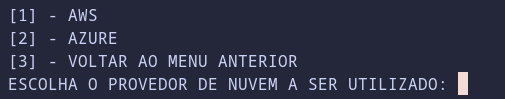
	+ Nessa tela, escolha a nuvem a ser utilizada e a criação do seu cluster será iniciada.
2. CENÁRIO GUIADO.
	+ Esta opção fornece um link para acessar um cenário guiado disponível neste repositório.
3. DESTRUIR CLUSTER KUBERNETS.
	+ Nesta opção, você pode destruir o cluster criado. Ao selecionar esta opção, verá a seguinte tela:
	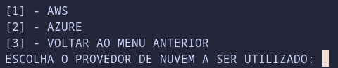
	+ Escolha a nuvem a ser utilizada e seu cluster será destruído.
4. SAIR.
	+ Esta opção encerra a ferramenta.
---

## CENÁRIO DE ESTUDOS

1. [Realizado deploy simples de uma aplicação Python no Kubernetes](cenarios/deploy_app.md)