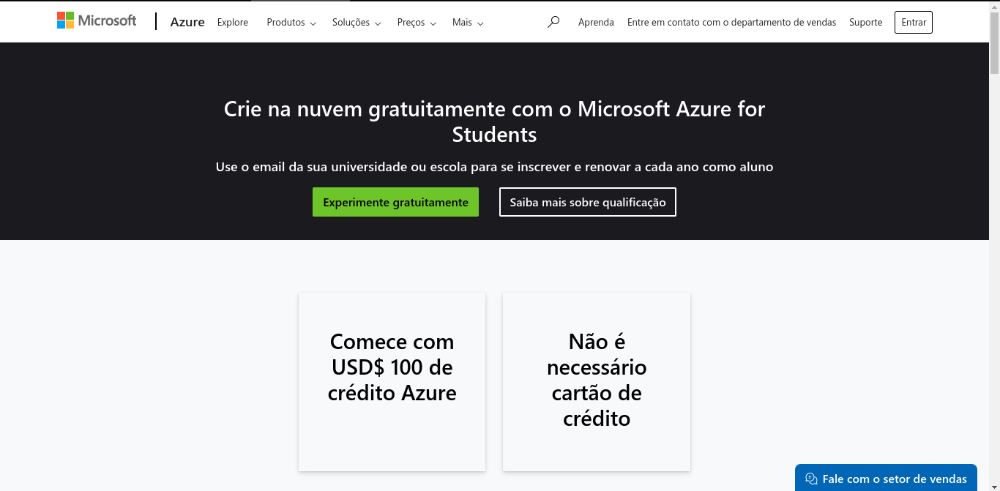
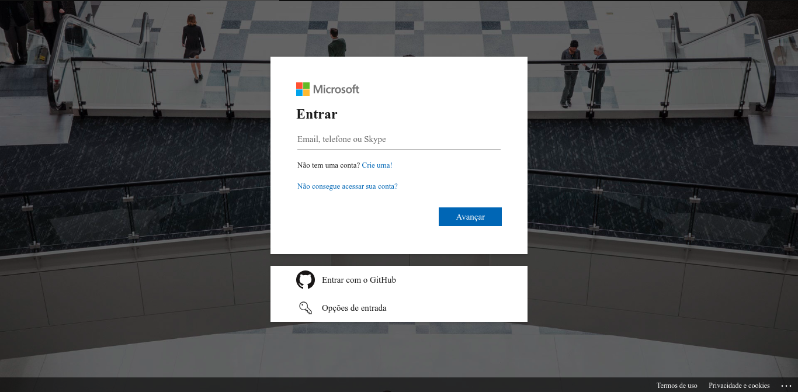
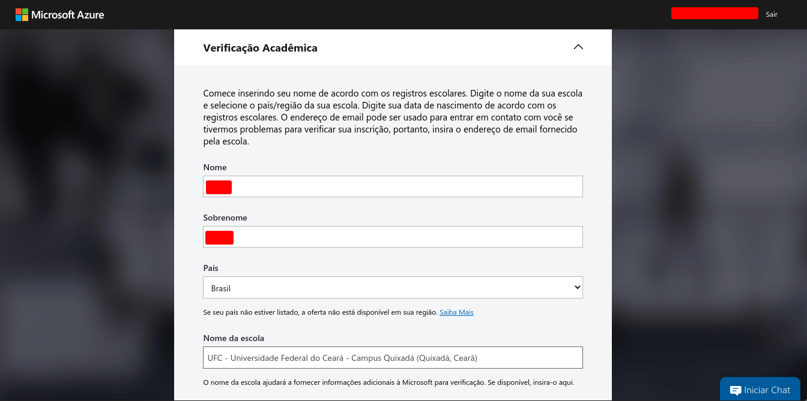
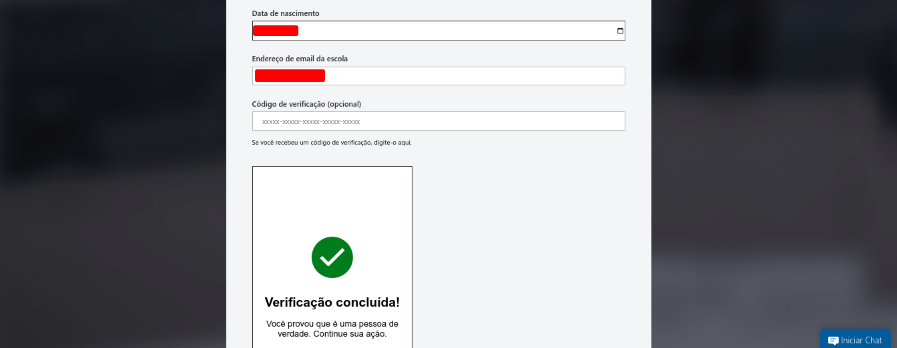
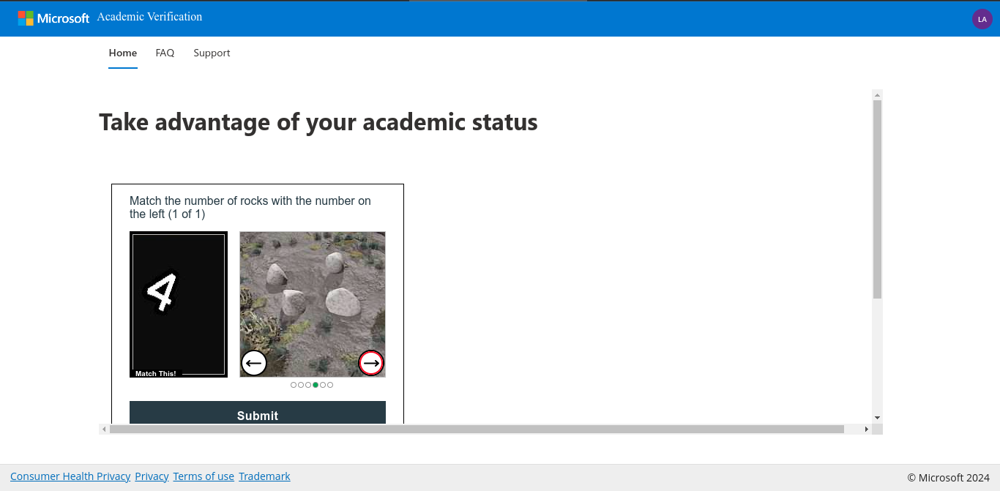
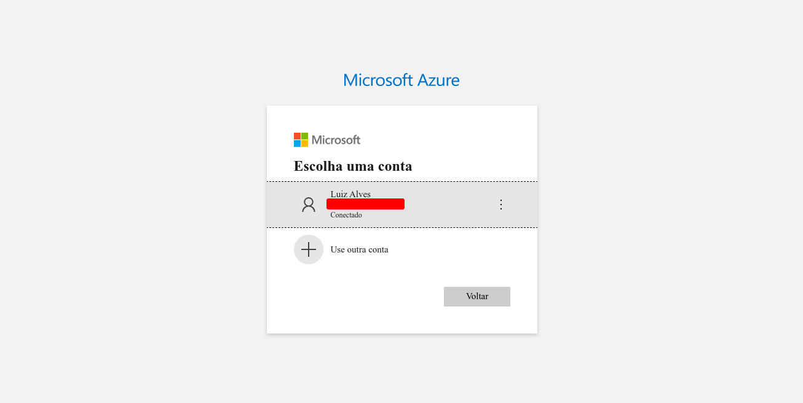
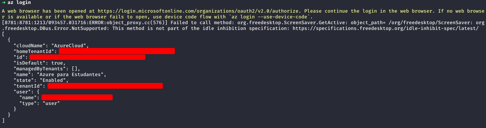
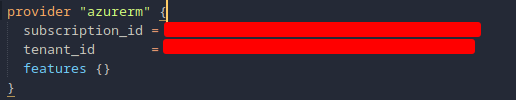

### Criando conta na Azure for Students.

1. **Acesse o site https://azure.microsoft.com/pt-br/free/students**



2. **Acesse sua conta microssoft colocando usuário e senha. Caso não possua crie uma.**



3. **Preencha o questionário com seu nome, sobrenome, país de origem, universidade, data de nascimento e email institucional.**




4. **Realize a verificação do email institucional.**


5. **Após isso você será redirecionado para uma página que irá testar se você é realmente humano. Realize o teste e siga para a proxima página.**



6. **Aceite os termos e pronto, você terá 100 USD para gastar como quiser na Azure.**


### Configurando a Azure para uso da ferramenta.

+ **Execute o seguinte comando para logar em seu navegador padrão.**

```
az login
```



+ **Será apresentado essa saída em seu terminal**



+ **Copie seu `subscription_id` e `tenant_id` para o arquivo que se encontra em infraestrutura/azure/main.tf**

