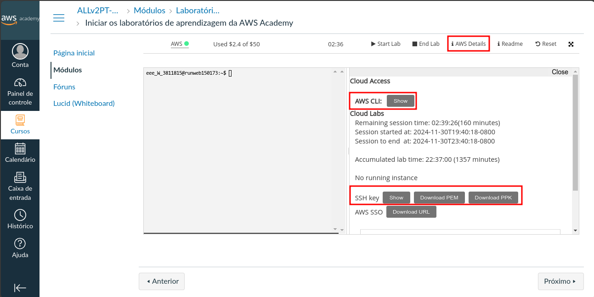

+ **Acesse o AWS Academy.**

+ **Após ter acesso o AWS academy e iniciado seu laborátorio irá clicar em `AWS Details`, baixe sua chave de acesso, e logo depois clique em `AWS CLI show`, copie o conteúdo mostrado.**

+ **Após isso execute o seguinte comando no terminal `aws configure`, esse comando irá gerar os arquivos de configuração do AWS CLI que irá permitir a coneção do terraform, deixe todos os campos em branco somente apertando enter.**

+ **Após isso pegue o conteudo copiado em `AWS CLI show` e cole em ~/.aws/credentials. Pronto você está pronto para utilizar a ferramenta na AWS.**

+ **OBS: Toda vez que você iniciar uma sessão no AWS Academy, suas credenciais irão ser alteradas, desse modo você precisar copiar seus dados e colar novamente em ~/.aws/credentials.**