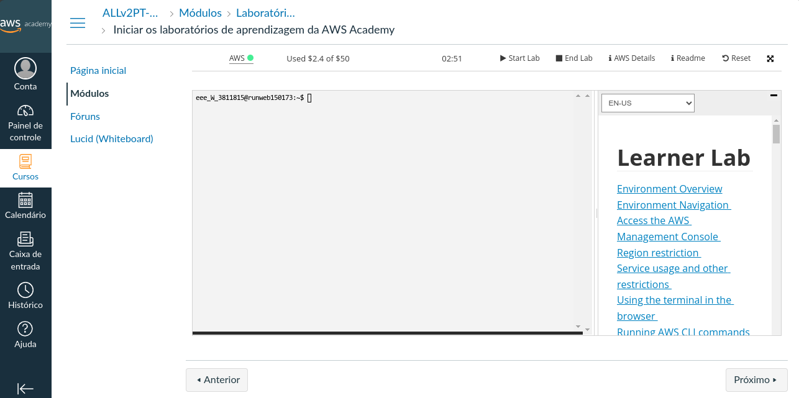

## Configurando o AWS CLI

+ Acesse o AWS Academy.



1. Após ter acesso o AWS academy e iniciado seu laborátorio irá clicar em `AWS Details`, e baixe sua chave de acesso.


2. Após isso clique em `AWS CLI: Show`, copie o conteúdo que irá aparecer.


3. Após isso execute o seguinte comandos em seu terminal.

```bash
aws configure
```


4. Após isso você irá colar o conteúdo copiado no passo 2 no arquivo `~/.aws/credentials`


5. A ferramenta espera que a chave de acesso esteja em `~/.aws/`, para funcionar corretamente, então por favor copie a chave de acesso baixada no passo 1 para `~/.aws`, com o seguinte comando.

```bash
mv LOCAL_ONDE_A_CHAVE_FOI_BAIXADA ~/.aws

```

+ Dê as permissões necessárias com o seguinte comando.

```bash
chmod 0600 ~/.aws/labsuser.pem
```

> [!IMPORTANT]
> Toda vez que você iniciar uma sessão no AWS Academy, suas credenciais irão ser alteradas, desse modo você precisa copiar seus dados e colar novamente em ~/.aws/credentials, para a ferramenta funcionar corretamente.

+ Pronto! Agore siga para a [utilização da ferramenta](../README.md/#5.-Utilizando-a-ferramenta) 
