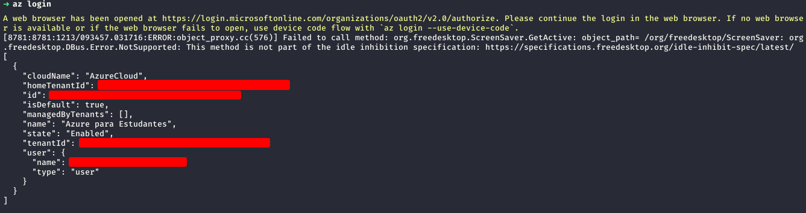

### Configurando a Azure para uso da ferramenta.

+ **Execute o seguinte comando para logar em seu navegador padrão.**

```
az login
```


+ **Será apresentado essa saída em seu terminal**



+ **Copie seu `subscription_id` e `tenant_id` para o arquivo que se encontra em infraestrutura/azure/main.tf**

